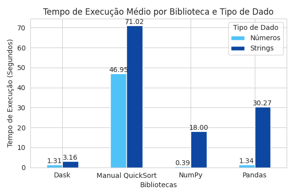
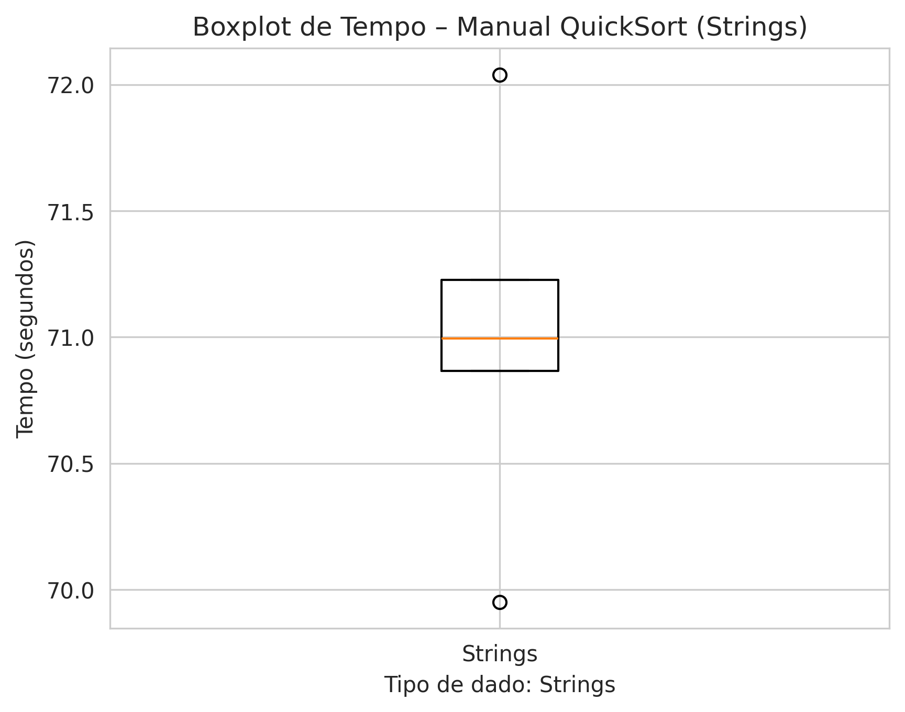
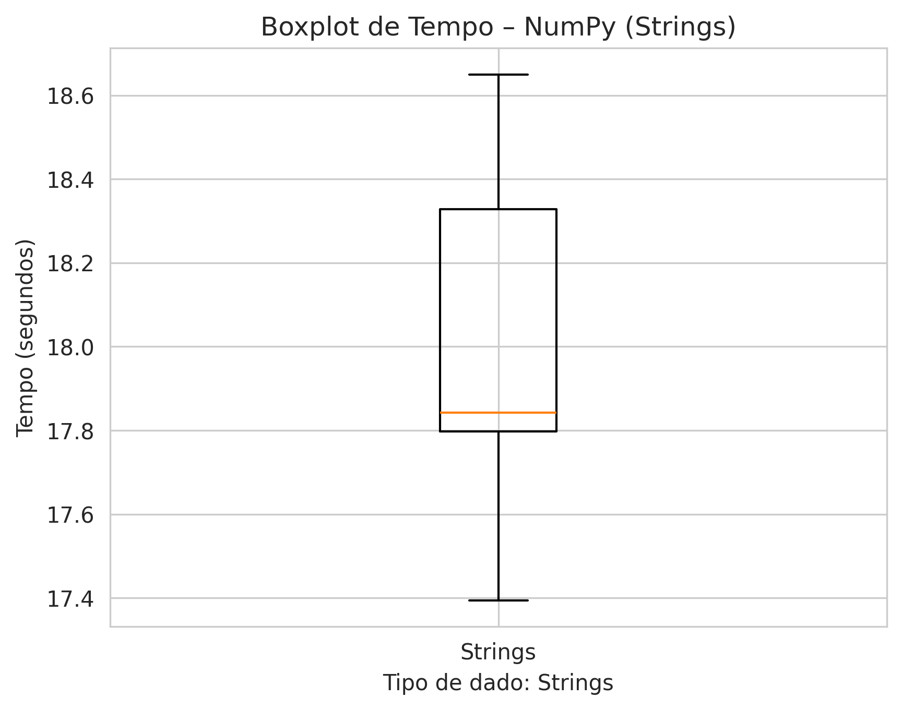
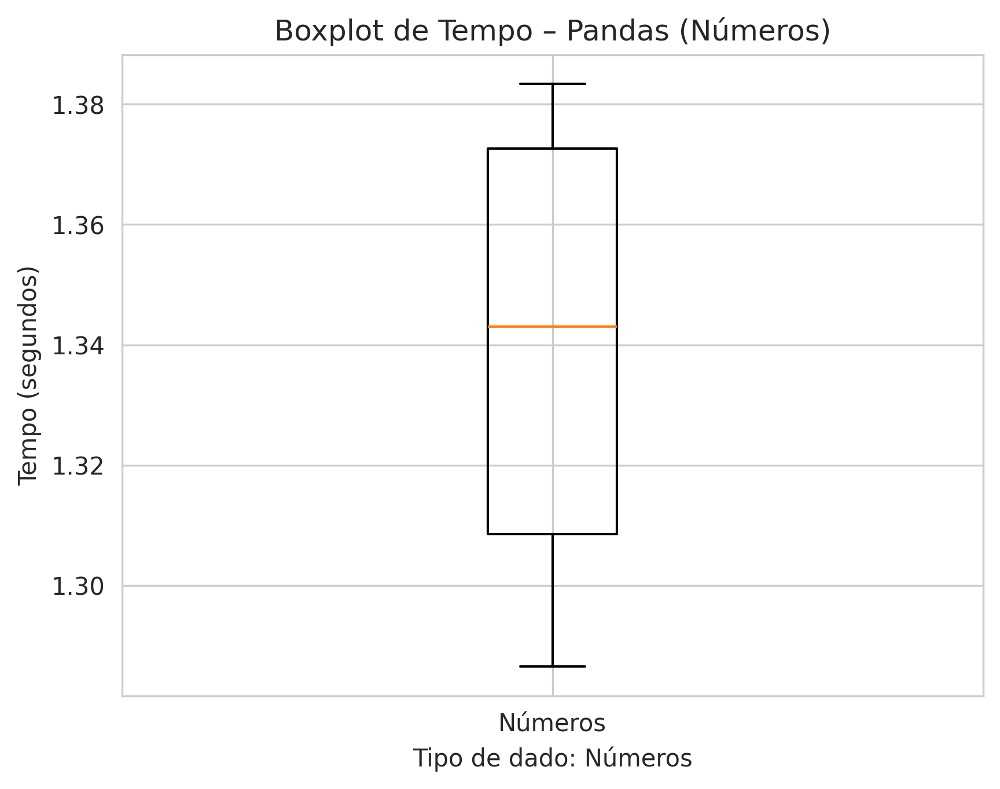
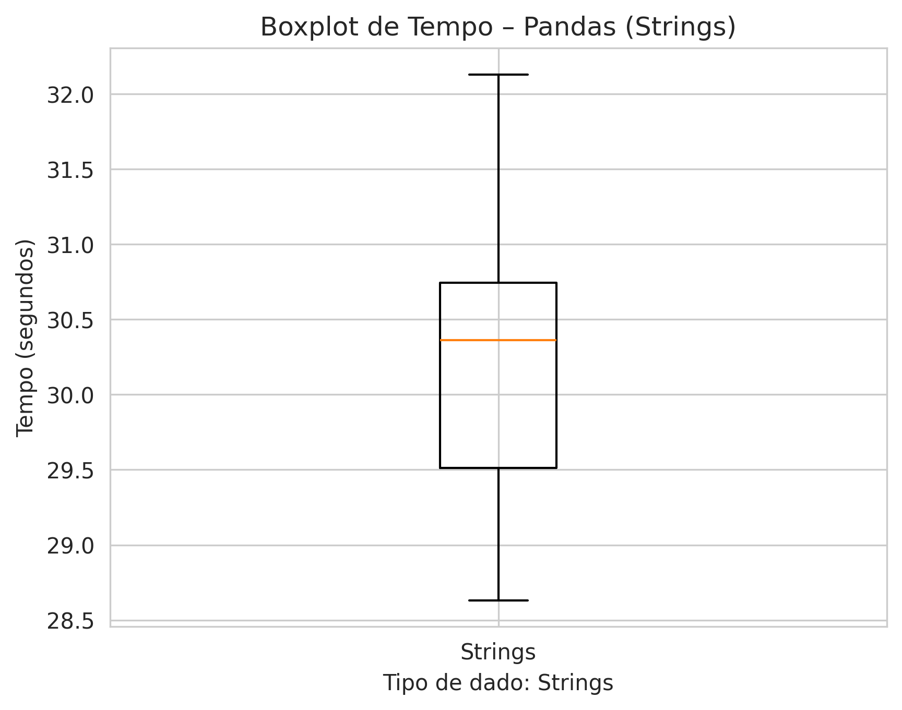
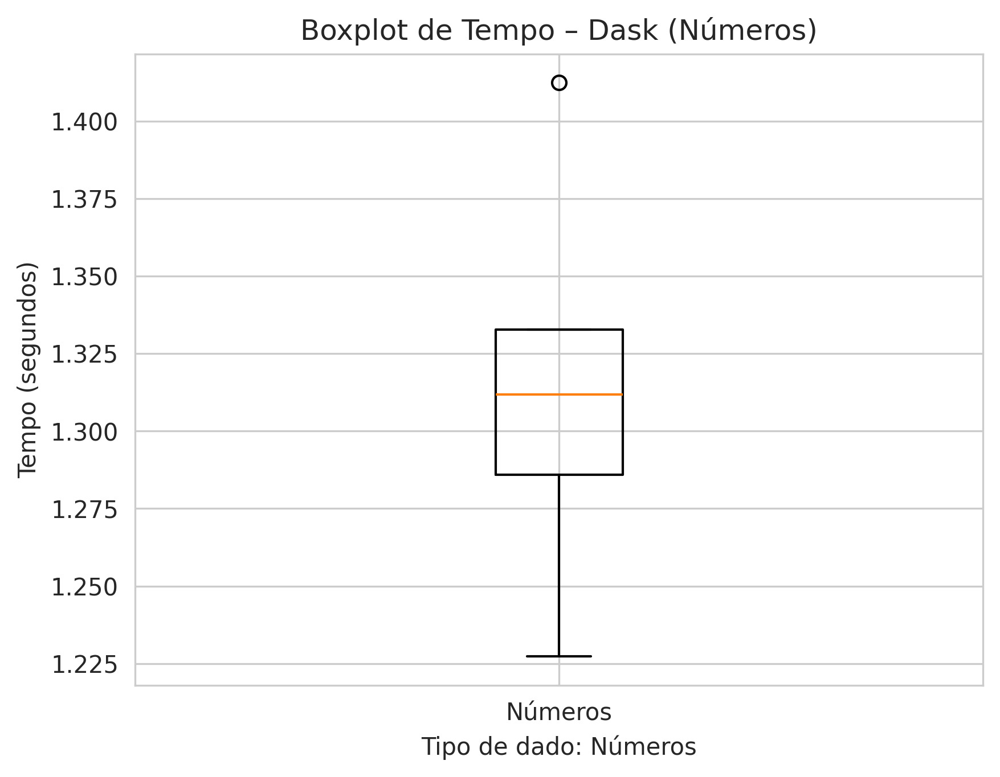
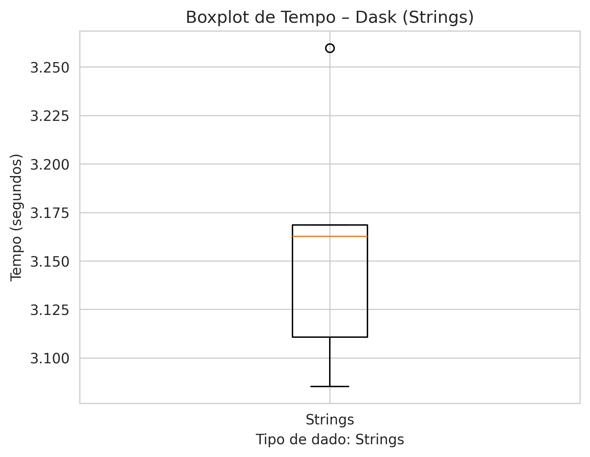
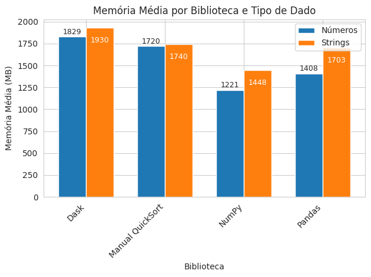

# Seminario 1: Comparação de Algoritmos de Ordenação em Diferentes Bibliotecas Python

## Índice

1. [Introdução](#introdução)  
2. [Algoritmos e Implementações](#algoritmos-e-implementações)  
3. [Complexidade Teórica](#complexidade-teórica)  
4. [Metodologia](#metodologia)  
5. [Resultados Estatísticos](#resultados-estatísticos)  
6. [Boxplots de Tempo](#boxplots-de-tempo)  
7. [Consumo de Memória](#consumo-de-memória)  
8. [Custos de Execução](#custos-de-execução)  
9. [Conclusão e Recomendações](#conclusão-e-recomendações)  
10. [Código-Fonte](#código-fonte)  
11. [Referências Bibliográficas](#referências-bibliográficas)  

---

## Introdução

Neste experimento, iremos avaliar e comparar o desempenho de diferentes implementações de algoritmos de ordenação em Python aplicadas a dois tipos de dados:

- **Bibliotecas utilizadas**  
  - **NumPy**: biblioteca de computação numérica em Python, responsável por operações vetoriais de alto desempenho.  
  - **Pandas**: construída sobre o NumPy, fornece estruturas de dados tabulares (`DataFrame`) e métodos de ordenação.  
  - **Dask**: framework de computação paralela e distribuída, baseado em NumPy e Pandas, que permite processar grandes `DataFrame` em partições.  
  - **memory_profiler**: ferramenta para medir o consumo de memória das funções de ordenação.

- **Tipos de dados**  
  1. **Números**: vetores de `float` gerados aleatoriamente.  
  2. **Strings**: listas de cadeias de caracteres de comprimento fixo (5 caracteres), também geradas aleatoriamente.

O objetivo é entender como cada abordagem se comporta em termos de **tempo de execução** e **consumo de memória** para bases de grande escala (configuradas aqui com `N = 10_000_000` elementos).

## Explicação do Quicksort (Hoare, 1961)

O Quicksort, proposto por C. A. R. Hoare em 1961 na revista *Communications of the ACM* :contentReference[oaicite:0]{index=0}, é um algoritmo de ordenação por comparação que segue a estratégia de **dividir e conquistar**:

1. **Escolha do pivô**  
   - Um elemento da lista (comummente o do meio, mas pode ser o primeiro ou o último) é selecionado como pivô.

2. **Particionamento (Hoare partition scheme)**  
   - Dois ponteiros, `i` e `j`, iniciam em `lo–1` e `hi+1`, respectivamente.  
   - Avança-se `i` até encontrar um elemento ≥ pivô, e retrocede-se `j` até encontrar um elemento ≤ pivô.  
   - Se `i < j`, troca-se `A[i]` com `A[j]` e continua-se o processo; caso contrário, retorna-se `j` como ponto de separação.  
   - Ao final:
     - Todos os elementos em índices ≤ `j` são ≤ pivô.
     - Todos os elementos em índices > `j` são ≥ pivô.  
   - Esse particionamento é feito **in-place**, exigindo apenas O(1) de espaço auxiliar (além da pilha de recursão) :contentReference[oaicite:1]{index=1}.

3. **Recursão**  
   - Aplica-se Quicksort nas sublistas `A[lo..j]` e `A[j+1..hi]`, até que cada sublista tenha tamanho ≤ 1.

4. **Conquista**  
   - Como cada sublista fica ordenada internamente, a lista inteira fica ordenada ao final das recursões.

---

### Pseudocódigo Simplificado

```pseudo
function quicksort(A, lo, hi):
    if lo < hi:
        p = partition(A, lo, hi)
        quicksort(A, lo, p)
        quicksort(A, p + 1, hi)

function partition(A, lo, hi):
    pivot = A[(lo + hi) // 2]
    i = lo - 1
    j = hi + 1
    while true:
        repeat i ← i + 1 until A[i] ≥ pivot
        repeat j ← j - 1 until A[j] ≤ pivot
        if i ≥ j:
            return j
        swap A[i] with A[j]
```

## Bibliotecas Avaliadas
- NumPy
- Pandas
- Dask

## Implementação dos Algoritmos de Ordenação por Biblioteca

### Manual

A implementaçao usando list comprehensions — escolhendo o pivô (aqui, o elemento do meio) e recursivamente concatenando as listas.

```python
def quicksort_manual(arr):
    if len(arr) <= 1:
        return arr
    pivot = arr[len(arr)//2]
    left   = [x for x in arr if x <  pivot]
    middle = [x for x in arr if x == pivot]
    right  = [x for x in arr if x >  pivot]
    return quicksort_manual(left) + middle + quicksort_manual(right)
```

- [Fonte - Algorithm 64: Quicksort](https://dl.acm.org/doi/10.1145/366622.366644)

**Resumo da Complexidade**:

| Caso           | Tempo        | Espaço extra |
| -------------- | ------------ | ------------ |
| Melhor caso    | O(n log n)   | O(n)         |
| Caso médio     | O(n log n)   | O(n)         |
| Pior caso      | O(n²)        | O(n)         |

#### NumPy

Para o NumPy, utilizamos a função `np.sort()` com o parâmetro `kind='quicksort'`, que internamente utiliza uma implementação otimizada do algoritmo QuickSort escrita em C++.

Essa implementação é parte do núcleo da biblioteca e pode ser encontrada no repositório oficial do NumPy, no diretório [`npysort`](https://github.com/numpy/numpy/tree/main/numpy/_core/src/npysort). A seguir, uma versão didática simplificada da lógica usada:

```cpp
template<typename T>
void quicksort(T* arr, int left, int right) {
    if (left >= right) return;

    T pivot = arr[right];
    int i = left - 1;

    for (int j = left; j < right; ++j) {
        if (arr[j] <= pivot) {
            ++i;
            std::swap(arr[i], arr[j]);
        }
    }
    std::swap(arr[i + 1], arr[right]);

    quicksort(arr, left, i);
    quicksort(arr, i + 2, right);
}
```

O `np.sort()` permite escolher o algoritmo por meio do parâmetro `kind`. O QuickSort é acessado via `kind='quicksort'`. Ele é rápido, mas não estável.

```python
import numpy as np
def sort_numpy_numeros():
    return np.sort(df_numeros["valor"].to_numpy(), kind="quicksort")
```

Segundo a documentação interna da função `np.sort()`:

```text
kind : {'quicksort', 'mergesort', 'heapsort', 'stable'}, optional
    Sorting algorithm. The default is 'quicksort'. Note that both 'stable'
    and 'mergesort' use timsort or radix sort under the covers and,
    in general, the actual implementation will vary with data type.
    The 'mergesort' option is retained for backwards compatibility.
```   

### Pandas
Utiliza o NumPy internamente para ordenação. Portanto, pode utilizar QuickSort dependendo da configuração padrão do NumPy.

```python
import pandas as pd
def sort_pandas_numeros():
    return df_numeros.sort_values("valor", kind="quicksort")
```

Segundo a documentação interna da função `pd.sort_values()`:

```text
kind : {'quicksort', 'mergesort', 'heapsort', 'stable'}, default 'quicksort'
             Choice of sorting algorithm. See also :func:`numpy.sort` for more
             information. `mergesort` and `stable` are the only stable algorithms. For
             DataFrames, this option is only applied when sorting on a single
             column or label.
```   

### Dask
Executa ordenações distribuídas, utilizando algoritmos baseados em particionamento. Pode usar QuickSort localmente, mas não é garantido.

```python
import dask.dataframe as dd
def sort_dask_numeros():
    ddf = dd.from_pandas(df_numeros, npartitions=4)
    return ddf.map_partitions(lambda d: d.sort_values("valor", kind="quicksort")).compute()
```

Segundo a documentação interna da função `df.sort_values()`:

```text
kind : {'quicksort', 'mergesort', 'heapsort', 'stable'}, default 'quicksort'
             Choice of sorting algorithm. See also :func:`numpy.sort` for more
             information. `mergesort` and `stable` are the only stable algorithms. For
             DataFrames, this option is only applied when sorting on a single
             column or label.
```   

## Resumo Comparativo

| Biblioteca | Complexidade                        | Ordenação Global                    | Controle de `kind`         | Observações                                         |
|------------|-------------------------------------|--------------------------------------|-----------------------------|-----------------------------------------------------|
| NumPy      | O(n log n)                          | Sim                                  | Sim                         | Rápido e direto, implementado em C                  |
| Pandas     | O(n log n)                          | Sim                                  | Sim                         | Mais lento devido à estrutura e indexação           |
| Dask       | O(n log m) ou O(n log n + shuffle)  | Não (`map_partitions`) / Sim (`sort_values`) | Parcial (via Pandas)         | Paralelo, mas ordenação global exige custo de shuffle |

## Tipos de Entrada
- Números aleatórios
- Cadeias de caracteres aleatórias

---

## Resultados Estatísticos


| Biblioteca         | Tipo     | Tempo Médio (s) | Tempo Mediana (s) | Tempo Mínimo (s) | Tempo Máximo (s) |
|--------------------|----------|-----------------|-------------------|------------------|------------------|
| Manual QuickSort   | números  | 46.953697       | 47.179435         | 43.907896        | 48.877947        |
| Manual QuickSort   | strings  | 71.015259       | 70.993828         | 69.950651        | 72.039560        |
| NumPy              | números  | 0.392367        | 0.391374          | 0.383444         | 0.401444         |
| NumPy              | strings  | 18.002635       | 17.842649         | 17.394188        | 18.649801        |
| Pandas             | números  | 1.338831        | 1.343063          | 1.286489         | 1.383379         |
| Pandas             | strings  | 30.274953       | 30.360508         | 28.631620        | 32.129163        |
| Dask               | números  | 1.314070        | 1.311920          | 1.227271         | 1.412463         |
| Dask               | strings  | 3.157377        | 3.162664          | 3.085290         | 3.259809         |

---

## Gráfico de Tempo Médio de Execução

Este gráfico compara o tempo médio de execução dos algoritmos de ordenação em diferentes bibliotecas, separados por tipo de dado.



---

## Boxplots de Tempo de Execução

A seguir, apresentamos os boxplots de tempo de execução para cada algoritmo, dispostos em dois por linha. Cada gráfico mantém seu próprio eixo.

---

### Manual QuickSort

| Números | Strings |
|:-------:|:-------:|
|  |  |

---

### NumPy

| Números | Strings |
|:-------:|:-------:|
|  |  |

---

### Pandas

| Números | Strings |
|:-------:|:-------:|
|  |  |

### Dask

| Números | Strings |
|:-------:|:-------:|
|  |  |

---

## Resumo de Memória e Custos Médios por Biblioteca e Tipo de Dado

| Biblioteca       | Tipo     | Memória Média (MB) | AWS (US$/exec) | GCP (US$/exec) | Azure (US$/exec) |
|------------------|----------|--------------------|----------------|----------------|------------------|
| Manual QuickSort | números  | 1720.389           | 0.001252       | 0.000874       | 0.000678         |
| Manual QuickSort | strings  | 1739.571           | 0.001894       | 0.001322       | 0.001026         |
| NumPy            | números  | 1220.879           | 0.000010       | 0.000007       | 0.000006         |
| NumPy            | strings  | 1256.312           | 0.000381       | 0.000266       | 0.000206         |
| Pandas           | números  | 1802.104           | 0.000025       | 0.000017       | 0.000013         |
| Pandas           | strings  | 1830.745           | 0.000765       | 0.000536       | 0.000416         |
| Dask             | números  | 1828.586           | 0.000035       | 0.000024       | 0.000019         |
| Dask             | strings  | 1929.573           | 0.000084       | 0.000059       | 0.000046         |


## Consumo Médio de Memória por Biblioteca e Tipo de Dado



**Análise dos Resultados**
 
- **Manual QuickSort** fica logo atrás com ~1 720 MB (números) e ~1 740 MB (strings), mostrando que as recursões e as várias listas temporárias também pesam bastante na RAM.
- **NumPy** continua muito enxuto, consumindo em torno de ~1 221 MB (números) e ~1 448 MB (strings), pois opera diretamente sobre arrays contíguos em C, sem criar estruturas auxiliares em Python.
- **Pandas**, apesar de ser mais “friendly” e generalista, mantém um consumo intermediário: ~1 408 MB para números e ~1 703 MB para strings.  
- **Dask** é a biblioteca que consome mais memória, com médias de ~1 829 MB para números e ~1 930 MB para strings, graças ao overhead de particionamento e agendamento paralelo. 

Se o objetivo for minimizar o footprint de memória, o **NumPy** é a escolha mais leve; para processamento paralelo de grandes conjuntos de dados, o **Dask** entrega performance à custa de mais RAM. As implementações em **Pandas** e **QuickSort manual** ficam em um meio-termo, equilibrando usabilidade e consumo.  

## Comparação de Custos de Execução

A tabela a seguir mostra o **custo médio por execução** em cada provedor de nuvem (USD), para cada biblioteca e tipo de dado:

| Biblioteca         | Tipo     | AWS (US$/exec) | GCP (US$/exec) | Azure (US$/exec) |
|--------------------|----------|----------------|----------------|------------------|
| **Dask**           | números  | 0.000035       | 0.000024       | 0.000019         |
| **Dask**           | strings  | 0.000084       | 0.000059       | 0.000046         |
| **Manual QuickSort** | números  | 0.001252       | 0.000874       | 0.000678         |
| **Manual QuickSort** | strings  | 0.001894       | 0.001322       | 0.001026         |
| **NumPy**          | números  | 0.000010       | 0.000007       | 0.000006         |
| **NumPy**          | strings  | 0.000381       | 0.000266       | 0.000206         |
| **Pandas**         | números  | 0.000025       | 0.000017       | 0.000013         |
| **Pandas**         | strings  | 0.000765       | 0.000536       | 0.000416         |

---

### Análise dos Custos

- **AWS** é consistentemente o provedor **mais caro**, em média, para todas as bibliotecas e tipos de dado.  
- **Azure** oferece as tarifas **mais baixas**, com economia de ~40–45% frente à AWS e ~20–30% frente ao GCP.  
- **GCP** fica em posição **intermediária**, cerca de 30% mais barato que a AWS, mas ainda acima do Azure.  
- Em **strings**, todos os custos disparam (até 20×) comparado a dados numéricos, refletindo o maior tempo gasto na ordenação de objetos Python.  
- A **eficiência de custo** (custo por segundo) segue a mesma ordem de desempenho em tempo:  
  1. **NumPy** (menor tempo → menor custo)  
  2. **Pandas**  
  3. **Dask**  
  4. **Manual QuickSort** (mais lento → mais caro) 

---

## Conclusão e Recomendações

Ao longo deste experimento, comparamos quatro abordagens de ordenação em Python — Manual QuickSort, NumPy, Pandas e Dask — sobre dois tipos de dados (vetores de floats e listas de strings), medindo **tempo**, **memória** e **custo** em três provedores de nuvem (AWS, GCP e Azure).

| Critério                | Melhor Escolha        | Observações                                                                                                                                          |
|-------------------------|-----------------------|------------------------------------------------------------------------------------------------------------------------------------------------------|
| **Velocidade (números)**    | **NumPy**              | Median ~0.39 s; algorítmico otimizado em C.                                                                                                          |
| **Velocidade (strings)**    | **Dask**               | Median ~3.16 s; paralelismo reduz variação e acelera objetos Python.                                                                                 |
| **Uso de Memória**      | **NumPy**              | ~1 221 MB (números) e ~1 448 MB (strings); arrays contíguos, sem overhead de Python.                                                                  |
| **Custo por Execução**  | **NumPy + Azure**      | NumPy gera o menor custo/execução; Azure tem as menores tarifas (até ~45 % mais barato que AWS).                                                       |
| **Equilíbrio Geral**    | **Pandas**             | Boa legibilidade e integração com DataFrame, desempenho intermediário (1–2 s para números, ~30 s para strings) a custo moderado.                      |
| **Uso Didático**        | **Manual QuickSort**   | Excelente para entender o algoritmo, mas inviável em escala: ~47 s (números) a ~71 s (strings), maior consumo de memória e custo mais alto.            |

### Recomendação Final

- **Para produção numérica de alto desempenho e otimização de custos**, use **NumPy** em conjunto com instâncias **Azure** para ordenação de vetores de floats.  
- **Para cargas heterogêneas que envolvem muitas strings** e onde paralelismo importa (e CPU/memória não são limitantes), prefira **Dask** em Azure/GCP.  
- **Para análises ad hoc e manipulação de DataFrames**, o **Pandas** é o compromisso certo entre usabilidade e desempenho.  
- **Reserve a implementação manual de QuickSort** apenas para demonstrações didáticas e depuração conceitual — em cenários reais, bibliotecas otimizadas superam o Python puro. Pandas teve desempenho intermediário em tempo, mas o uso de memória pode variar.

---

## Código-Fonte

O código completo do experimento (notebook e scripts auxiliares) está disponível no GitHub:

- **Repositório**:  
  https://github.com/ChristianSF/Analise-de-Algoritmos-e-Estruturas-de-Dados-AAED-/tree/main/Seminario_1/code

---

## Referências Bibliográficas

1. Hoare, C. A. R. (1961). “Quicksort.” *Communications of the ACM*, 4(7), 321–322.  
2. Cormen, T. H.; Leiserson, C. E.; Rivest, R. L.; Stein, C. (2009). *Introduction to Algorithms* (3ª ed.). MIT Press.  
3. Harris, C. R. et al. (2020). “Array programming with NumPy.” *Nature*, 585, 357–362.  
4. McKinney, W. (2018). *Python for Data Analysis* (2ª ed.). O’Reilly Media.  
5. Dask Development Team. (2024). *Dask: Library for dynamic task scheduling & “Big Data”*. Disponível em: https://docs.dask.org  
6. McKinney, W.; Bohannon, P.; Gentry, J.; Pandas Development Team. (2024). *pandas — Python Data Analysis Library*. Disponível em: https://pandas.pydata.org  
7. Jahn, D.; Ritschard, H. (2012). *memory_profiler — monitoramento de memória em Python*. Disponível em: https://github.com/pythonprofilers/memory_profiler  
8. Amazon Web Services. (2025). *AWS Pricing Calculator*. Disponível em: https://aws.amazon.com/pricing/  
9. Google Cloud Platform. (2025). *GCP Pricing*. Disponível em: https://cloud.google.com/pricing  
10. Microsoft Azure. (2025). *Azure Pricing*. Disponível em: https://azure.microsoft.com/pricing 
